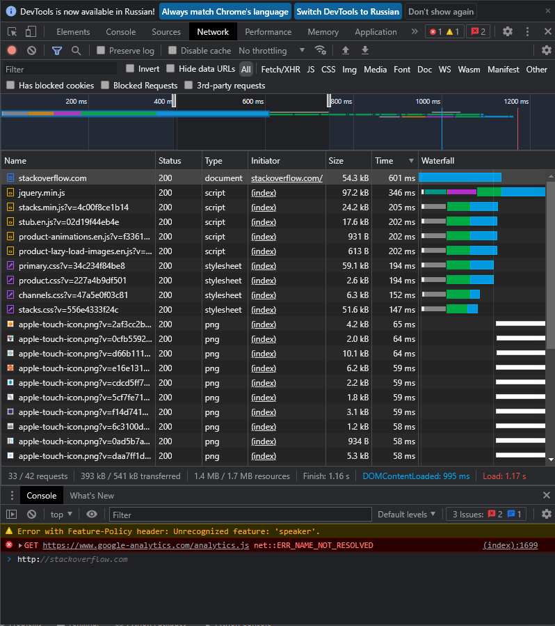

1)  
HTTP/1.1 301 Moved Permanently  
cache-control: no-cache, no-store, must-revalidate  
location: https://stackoverflow.com/questions  
x-request-guid: 0ef30a2a-7149-4dbe-a46f-701d2eab7763  
feature-policy: microphone 'none'; speaker 'none'  
content-security-policy: upgrade-insecure-requests; frame-ancestors 'self' https://stackexchange.com  
Accept-Ranges: bytes  
Date: Sat, 27 Nov 2021 14:48:45 GMT  
Via: 1.1 varnish  
Connection: close  
X-Served-By: cache-hel1410031-HEL  
X-Cache: MISS  
X-Cache-Hits: 0  
X-Timer: S1638024525.435199,VS0,VE117  
Vary: Fastly-SSL  
X-DNS-Prefetch-Control: off  
Set-Cookie: prov=083c4041-469d-8db5-ed92-33e1f7bd0343; domain=.stackoverflow.com; expires=Fri, 01-Jan-2055 00:00:00 GMT; path=/; HttpOnly  
  
Connection closed by foreign host.  

Получили ответ сервера.  
  
2)  
Request URL: http://stackoverflow.com/  
Request Method: GET  
Status Code: 307 Internal Redirect  
Referrer Policy: strict-origin-when-cross-origin  
Location: https://stackoverflow.com/  
Non-Authoritative-Reason: HSTS  
Accept: text/html,application/xhtml+xml,application/xml;q=0.9,image/avif,image/webp,image/apng,*/*;q=0.8,application/signed-exchange;v=b3;q=0.9  
Upgrade-Insecure-Requests: 1  
User-Agent: Mozilla/5.0 (Windows NT 10.0; Win64; x64) AppleWebKit/537.36 (KHTML, like Gecko) Chrome/96.0.4664.45 Safari/537.36  
  
  
   
3)   
188.232.158.172  
  
4)  
descr: CJSC "ER-Telecom Holding" Omsk branch  
origin: AS41843  
  
5)    
С виртуальной машины:  
vagrant@vagrant:~$ traceroute 8.8.8.8  
traceroute to 8.8.8.8 (8.8.8.8), 30 hops max, 60 byte packets  
 1  _gateway (10.0.2.2)  0.084 ms  0.095 ms  0.071 ms  
 2  _gateway (10.0.2.2)  1.140 ms  1.101 ms  1.073 ms  
Если я правильно понимаю, он сделал трассировку не до гугл сервиса, а до моего компьютера. Отправил и получил пакет (2 пункта).  
С локального компьютера Windiws:  
PS E:\netology> tracert 8.8.8.8  
Трассировка маршрута к dns.google [8.8.8.8]  
с максимальным числом прыжков 30:  
  
  1    <1 мс    <1 мс    <1 мс  192.168.1.1  
  2     1 ms     1 ms     1 ms  172.21.127.253  
  3     1 ms     1 ms     1 ms  lag-3-438.bgw01.omsk.ertelecom.ru [109.194.120.30]  
  4    43 ms    41 ms    41 ms  72.14.215.165  
  5    35 ms    35 ms    36 ms  72.14.215.166  
  6    42 ms    42 ms    42 ms  108.170.250.129  
  7    41 ms    42 ms    42 ms  108.170.250.130  
  8    65 ms    65 ms    65 ms  209.85.255.136  
  9    65 ms    65 ms    67 ms  72.14.238.168  
 10    65 ms    74 ms    66 ms  172.253.70.51  
 11     *        *        *     Превышен интервал ожидания для запроса.  
 12     *        *        *     Превышен интервал ожидания для запроса.  
 13     *        *        *     Превышен интервал ожидания для запроса.  
 14     *        *        *     Превышен интервал ожидания для запроса.  
 15     *        *        *     Превышен интервал ожидания для запроса.  
 16     *        *        *     Превышен интервал ожидания для запроса.  
 17     *        *        *     Превышен интервал ожидания для запроса.  
 18     *        *        *     Превышен интервал ожидания для запроса.  
 19     *        *        *     Превышен интервал ожидания для запроса.  
 20    65 ms    64 ms    64 ms  dns.google [8.8.8.8]  
  
Трассировка завершена.  
  
6)    
 Host                                                         Loss%   Snt   Last   Avg  Best  Wrst StDev  
 1. _gateway                                                   0.0%    41    0.1   0.1   0.1   0.3   0.0  
 2. 192.168.1.1                                                0.0%    41    1.0   1.0   0.8   1.3   0.1  
 3. 172.21.127.253                                             0.0%    41    2.0   1.6   1.5   2.0   0.1  
 4. lag-3-438.bgw01.omsk.ertelecom.ru                          0.0%    41    1.7   1.7   1.4   2.0   0.1  
 5. 72.14.215.165                                              0.0%    41   41.5  42.7  41.3  67.3   4.2  
 6. 72.14.215.166                                              0.0%    40   36.6  36.5  36.2  39.5   0.5  
 7. 108.170.250.129                                            0.0%    40   42.7  42.8  42.3  44.1   0.3  
 8. 108.170.250.130                                            0.0%    40   42.0  42.3  42.0  44.1   0.3  
 9. 209.85.255.136                                             2.5%    40   65.7  66.1  65.7  66.9   0.2  
10. 72.14.238.168                                              0.0%    40   65.4  66.9  65.2  83.6   4.4  
11. 172.253.70.51                                              0.0%    40   66.1  66.7  66.0  67.7   0.6  
12. (waiting for reply)  
13. (waiting for reply)  
14. (waiting for reply)  
15. (waiting for reply)  
16. (waiting for reply)  
17. (waiting for reply)  
18. (waiting for reply)  
19. (waiting for reply)  
20. (waiting for reply)  
21. dns.google                                                15.0%    40   65.2  65.3  65.1  65.6   0.1  
  
Самая большая задержка в 10 пункте, Avg 66.9.   
  
7)   
vagrant@vagrant:~$ dig google.com NS +noall +answer  
google.com.             29364   IN      NS      ns2.google.com.  
google.com.             29364   IN      NS      ns1.google.com.  
google.com.             29364   IN      NS      ns4.google.com.  
google.com.             29364   IN      NS      ns3.google.com.  
  
;; ANSWER SECTION:  
dns.google.com.         832     IN      A       8.8.4.4  
dns.google.com.         832     IN      A       8.8.8.8  
  
8)  
vagrant@vagrant:~$ dig -x 8.8.8.8  
  
; <<>> DiG 9.16.1-Ubuntu <<>> -x 8.8.8.8  
;; global options: +cmd  
;; Got answer:  
;; ->>HEADER<<- opcode: QUERY, status: NOERROR, id: 893  
;; flags: qr rd ra; QUERY: 1, ANSWER: 1, AUTHORITY: 0, ADDITIONAL: 1  
  
;; OPT PSEUDOSECTION:  
; EDNS: version: 0, flags:; udp: 65494  
;; QUESTION SECTION:  
;8.8.8.8.in-addr.arpa.          IN      PTR  
  
;; ANSWER SECTION:  
8.8.8.8.in-addr.arpa.   6120    IN      PTR     dns.google.  
  
;; Query time: 0 msec  
;; SERVER: 127.0.0.53#53(127.0.0.53)  
;; WHEN: Sat Nov 27 15:52:36 UTC 2021  
;; MSG SIZE  rcvd: 73  
  
PTR     dns.google  
  

