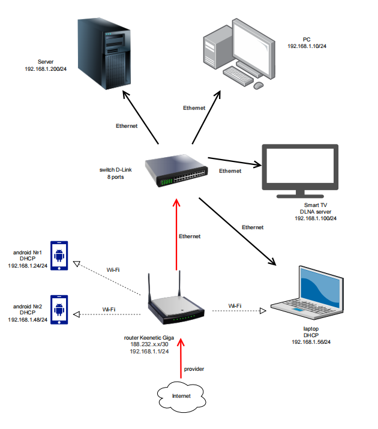

1)   
route-views>show ip route 188.232.158.172  
Routing entry for 188.232.156.0/22  
  Known via "bgp 6447", distance 20, metric 0  
  Tag 6939, type external  
  Last update from 64.71.137.241 5w1d ago  
  Routing Descriptor Blocks:  
  * 64.71.137.241, from 64.71.137.241, 5w1d ago  
      Route metric is 0, traffic share count is 1  
      AS Hops 3  
      Route tag 6939  
      MPLS label: none  
route-views>show bgp 188.232.158.172  
BGP routing table entry for 188.232.156.0/22, version 1220391874  
Paths: (24 available, best #21, table default)  
  Not advertised to any peer  
  Refresh Epoch 1  
  4901 6079 9002 9049 41843  
    162.250.137.254 from 162.250.137.254 (162.250.137.254)  
      Origin IGP, localpref 100, valid, external  
      Community: 65000:10100 65000:10300 65000:10400  
      path 7FE031842A10 RPKI State not found  
      rx pathid: 0, tx pathid: 0  
  Refresh Epoch 3  
  3303 9002 9049 41843  
    217.192.89.50 from 217.192.89.50 (138.187.128.158)  
      Origin IGP, localpref 100, valid, external  
      Community: 3303:1004 3303:1007 3303:1030 3303:3067 9002:64667  
      path 7FE138BF14D0 RPKI State not found  
      rx pathid: 0, tx pathid: 0  
  Refresh Epoch 1  
  7660 2516 1299 9049 41843  
    203.181.248.168 from 203.181.248.168 (203.181.248.168)  
      Origin IGP, localpref 100, valid, external  
      Community: 2516:1030 7660:9003  
      path 7FE1679F33F0 RPKI State not found  
      rx pathid: 0, tx pathid: 0  
  Refresh Epoch 1  
  3267 9049 41843  
    194.85.40.15 from 194.85.40.15 (185.141.126.1)  
      Origin IGP, metric 0, localpref 100, valid, external  
      path 7FE13E8CE7E8 RPKI State not found  
 --More--  
  
2)  
root@vagrant:/home/vagrant# echo 10.0.0.1 ${HOSTNAME} >> /etc/hosts  
root@vagrant:/home/vagrant# modprobe dummy  
root@vagrant:/home/vagrant# ip link add dummy1 type dummy  
root@vagrant:/home/vagrant# ip addr add 10.0.0.1/24 dev dummy1  
root@vagrant:/home/vagrant# ip addr add ${HOSTNAME}/24 dev dummy1  
Error: any valid prefix is expected rather than "vagrant/24".  
root@vagrant:/home/vagrant# ip addr add 127.0.0.1/24 dev dummy1  
root@vagrant:/home/vagrant# ip link set dummy1 up  
root@vagrant:/home/vagrant# ip link add dummy2 type dummy  
root@vagrant:/home/vagrant# ip link add dummy3 type dummy  
root@vagrant:/home/vagrant# ip addr add 10.0.0.2/24 dev dummy2  
root@vagrant:/home/vagrant# ip addr add 10.0.0.3/24 dev dummy3  
root@vagrant:/home/vagrant# ip link set dummy2 up  
root@vagrant:/home/vagrant# ip link set dummy3 up  
root@vagrant:/home/vagrant# ip a  
1: lo: <LOOPBACK,UP,LOWER_UP> mtu 65536 qdisc noqueue state UNKNOWN group default qlen 1000  
    link/loopback 00:00:00:00:00:00 brd 00:00:00:00:00:00  
    inet 127.0.0.1/8 scope host lo  
       valid_lft forever preferred_lft forever  
    inet6 ::1/128 scope host  
       valid_lft forever preferred_lft forever  
2: eth0: <BROADCAST,MULTICAST,UP,LOWER_UP> mtu 1500 qdisc fq_codel state UP group default qlen 1000  
    link/ether 08:00:27:73:60:cf brd ff:ff:ff:ff:ff:ff  
    inet 10.0.2.15/24 brd 10.0.2.255 scope global dynamic eth0  
       valid_lft 86115sec preferred_lft 86115sec  
    inet6 fe80::a00:27ff:fe73:60cf/64 scope link  
       valid_lft forever preferred_lft forever  
3: dummy1: <BROADCAST,NOARP,UP,LOWER_UP> mtu 1500 qdisc noqueue state UNKNOWN group default qlen 1000  
    link/ether 0a:b2:00:a6:24:dc brd ff:ff:ff:ff:ff:ff  
    inet 127.0.0.1/24 scope host dummy1  
       valid_lft forever preferred_lft forever  
    inet 192.168.1.151/24 brd 192.168.1.255 scope global dummy1  
       valid_lft forever preferred_lft forever  
    inet 10.0.0.1/24 scope global dummy1  
       valid_lft forever preferred_lft forever  
    inet6 fe80::8b2:ff:fea6:24dc/64 scope link  
       valid_lft forever preferred_lft forever  
4: dummy2: <BROADCAST,NOARP,UP,LOWER_UP> mtu 1500 qdisc noqueue state UNKNOWN group default qlen 1000  
    link/ether d6:eb:0e:44:1f:a8 brd ff:ff:ff:ff:ff:ff  
    inet 192.168.1.152/24 brd 192.168.1.255 scope global dummy2  
       valid_lft forever preferred_lft forever  
    inet 10.0.0.2/24 scope global dummy2  
       valid_lft forever preferred_lft forever  
    inet6 fe80::d4eb:eff:fe44:1fa8/64 scope link  
       valid_lft forever preferred_lft forever  
5: dummy3: <BROADCAST,NOARP,UP,LOWER_UP> mtu 1500 qdisc noqueue state UNKNOWN group default qlen 1000  
    link/ether ea:fd:25:78:b8:80 brd ff:ff:ff:ff:ff:ff  
    inet 10.0.0.3/24 scope global dummy3  
       valid_lft forever preferred_lft forever  
    inet6 fe80::e8fd:25ff:fe78:b880/64 scope link  
       valid_lft forever preferred_lft forever  
root@vagrant:/home/vagrant# ip r  
default via 10.0.2.2 dev eth0 proto dhcp src 10.0.2.15 metric 100  
10.0.0.0/24 dev dummy1 proto kernel scope link src 10.0.0.1  
10.0.0.0/24 dev dummy2 proto kernel scope link src 10.0.0.2  
10.0.0.0/24 dev dummy3 proto kernel scope link src 10.0.0.3  
10.0.2.0/24 dev eth0 proto kernel scope link src 10.0.2.15  
10.0.2.2 dev eth0 proto dhcp scope link src 10.0.2.15 metric 100  
127.0.0.0/24 dev dummy1 proto kernel scope link src 127.0.0.1  
192.168.1.0/24 dev dummy1 proto kernel scope link src 192.168.1.151  
192.168.1.0/24 dev dummy2 proto kernel scope link src 192.168.1.152  
  
3)  
root@vagrant:~# ss -tnlp  
State        Recv-Q        Send-Q               Local Address:Port               Peer Address:Port       Process  
LISTEN       0             4096                       0.0.0.0:111                     0.0.0.0:*  
 users:(("rpcbind",pid=714,fd=4),("systemd",pid=1,fd=35))  
LISTEN       0             4096                 127.0.0.53%lo:53                      0.0.0.0:*   
 users:(("systemd-resolve",pid=715,fd=13))  
LISTEN       0             128                        0.0.0.0:22                      0.0.0.0:*  
 users:(("sshd",pid=904,fd=3))  
LISTEN       0             4096                          [::]:111                        [::]:*  
 users:(("rpcbind",pid=714,fd=6),("systemd",pid=1,fd=37))  
LISTEN       0             128                           [::]:22                         [::]:*  
 users:(("sshd",pid=904,fd=4))  
  
22 - SSH  
53 - DNS  
111 - rpcbind — демон, сопоставляющий универсальные адреса и номера программ RPC.  
  
4)  
root@vagrant:~# ss -unap  
State       Recv-Q      Send-Q            Local Address:Port           Peer Address:Port      Process  
UNCONN      0           0                 127.0.0.53%lo:53                  0.0.0.0:*  
 users:(("systemd-resolve",pid=715,fd=12))  
UNCONN      0           0                10.0.2.15%eth0:68                  0.0.0.0:*  
 users:(("systemd-network",pid=1685,fd=22))  
UNCONN      0           0                       0.0.0.0:111                 0.0.0.0:*  
 users:(("rpcbind",pid=714,fd=5),("systemd",pid=1,fd=36))  
UNCONN      0           0                          [::]:111                    [::]:*  
 users:(("rpcbind",pid=714,fd=7),("systemd",pid=1,fd=38))  
  
68 - DHCP  
  
5)  
  

