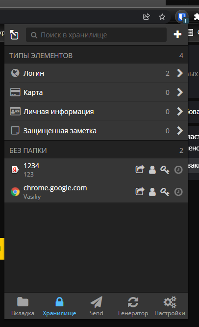
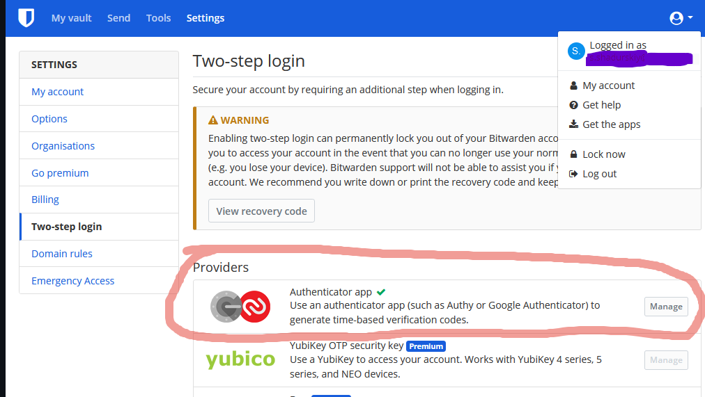
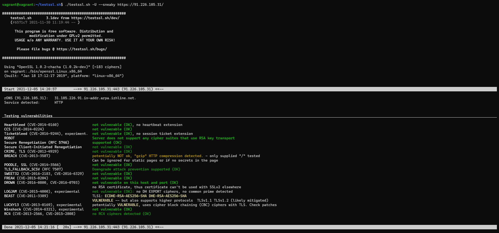
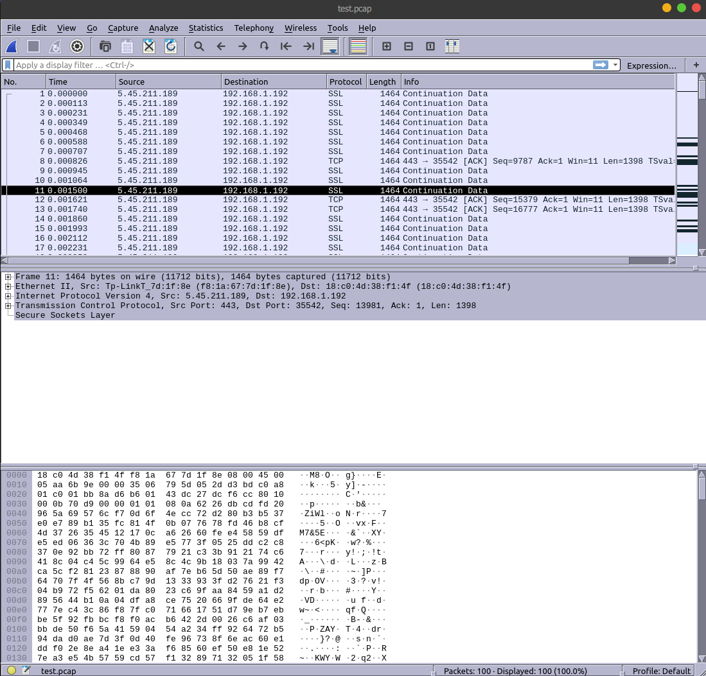

1)   

  
2)  

  
3)  
https://91.226.105.31/  
Сайт доступен как через http, так и через https.  
Через https нужно добавлять серитфикат SSL в доверенные, т.к. сертификат самописный.  

4)  
Проверил свой же сайт:  

5)  
SSH был уже установлен.  
vagrant@vagrant:~$ ssh-keygen  
Generating public/private rsa key pair.  
Enter file in which to save the key (/home/vagrant/.ssh/id_rsa):  
Enter passphrase (empty for no passphrase):  
Enter same passphrase again:  
Your identification has been saved in /home/vagrant/.ssh/id_rsa  
Your public key has been saved in /home/vagrant/.ssh/id_rsa.pub  
The key fingerprint is:  
SHA256:Te1CJgG5eo5FSjLWk8P5fW5+12eEMOApgajDyXtOTdM vagrant@vagrant  
The key's randomart image is:  
+---[RSA 3072]----+  
|     ..+.        |  
|    . o ....     |  
| o = o o.o+o.    |  
|  X O = E*o.o    |  
| . * X oS.o .o . |  
|  . = = . ..  . .|  
|   + =   o     o |  
|    o .   o . . +|  
|         o.. . ..|  
+----[SHA256]-----+  
  
vagrant@premiumq:~/.ssh$ ssh PremiumQ@192.168.1.118  
Welcome to Ubuntu 21.04 (GNU/Linux 5.11.0-36-generic x86_64)  
  
6)  
vagrant@vagrant:~/.ssh$ mv id_rsa  228PRIVAT  
vagrant@vagrant:~/.ssh$ mv id_rsa.pub 228PUBLIC  
  
vagrant@vagrant:/etc/ssh$ sudo nano ssh_config  
Host PremiumQ_node 
    Hostname 10.0.8.2  
    IdentityFile /root/.ssh/228PUBLIC  
  
vagrant@premiumq:~/.ssh$ ssh PremiumQ_node  
Welcome to Ubuntu 21.04 (GNU/Linux 5.11.0-36-generic x86_64)  
  
7)  
vagrant@vagrant:/$ sudo tcpdump -c 100 -w test.pcap  
tcpdump: listening on enp4s0, link-type EN10MB (Ethernet), capture size 262144 bytes  
100 packets captured  
251 packets received by filter  
0 packets dropped by kernel  

  

 