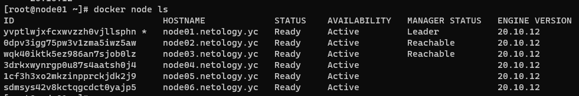
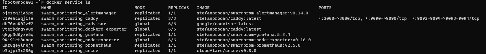

# Домашнее задание к занятию "5.5. Оркестрация кластером Docker контейнеров на примере Docker Swarm"


## Обязательная задача 1
Дайте письменые ответы на следующие вопросы:

В чём отличие режимов работы сервисов в Docker Swarm кластере: replication и global?
```
Relpication - Он находится в стольких экземлярах, сколько задаем.
Global - Сервис запускается на всех нодах. Обычно используется на экспортерах.
```
Какой алгоритм выбора лидера используется в Docker Swarm кластере?
```
Raft - алгоритм поддержания распределенного консенсуса.
```
Что такое Overlay Network?
```
Overlay Network — логическая или виртуальная сеть, созданная поверх другой сети.
```

## Обязательная задача 2
Создать ваш первый Docker Swarm кластер в Яндекс.Облаке

Для получения зачета, вам необходимо предоставить скриншот из терминала (консоли), с выводом команды:

```
docker node ls
```


## Обязательная задача 3

Создать ваш первый, готовый к боевой эксплуатации кластер мониторинга, состоящий из стека микросервисов.

Для получения зачета, вам необходимо предоставить скриншот из терминала (консоли), с выводом команды:

```
docker service ls
```


## Дополнительное задание (со звездочкой*) - необязательно к выполнению

Выполнить на лидере Docker Swarm кластера команду (указанную ниже) и дать письменное описание её функционала, что она делает и зачем она нужна:

```
# см.документацию: https://docs.docker.com/engine/swarm/swarm_manager_locking/
docker swarm update --autolock=true
```
