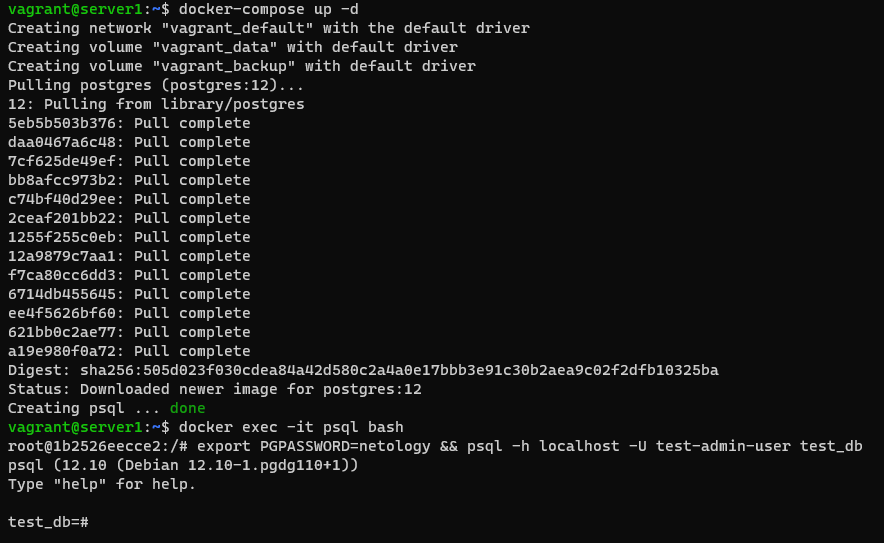
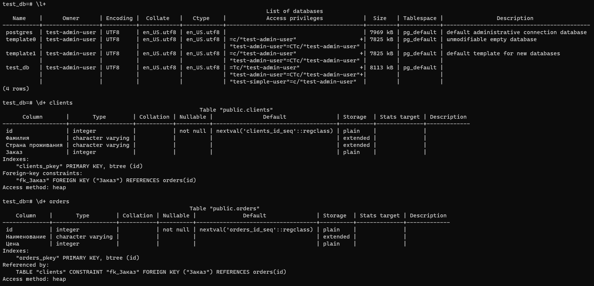
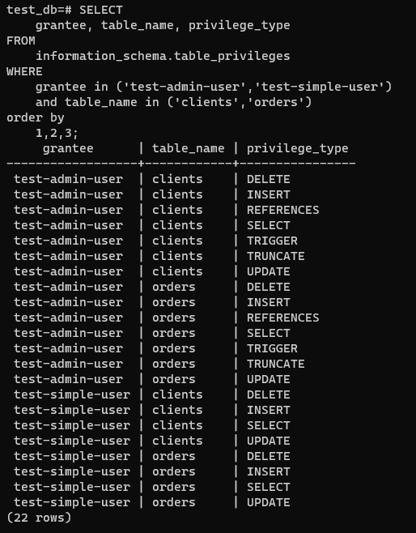

# Домашнее задание к занятию "6.2. SQL"


## Обязательная задача 1
Используя docker поднимите инстанс PostgreSQL (версию 12) c 2 volume, в который будут складываться данные БД и бэкапы.

Приведите получившуюся команду или docker-compose манифест.

docker-compose.yaml:
```yaml
volumes:
  data: {}
  backup: {}

services:

  postgres:
    image: postgres:12
    container_name: psql
    ports:
      - "0.0.0.0:5432:5432"
    volumes:
      - data:/var/lib/postgresql/data
      - backup:/media/postgresql/backup
    environment:
      POSTGRES_USER: "test-admin-user"
      POSTGRES_PASSWORD: "netology"
      POSTGRES_DB: "test_db"
    restart: always
```


## Обязательная задача 2
В БД из задачи 1:

- создайте пользователя test-admin-user и БД test_db
- в БД test_db создайте таблицу orders и clients (спeцификация таблиц ниже)
- предоставьте привилегии на все операции пользователю test-admin-user на таблицы БД test_db
- создайте пользователя test-simple-user
- предоставьте пользователю test-simple-user права на SELECT/INSERT/UPDATE/DELETE данных таблиц БД test_db

Таблица orders:

- id (serial primary key)
- наименование (string)
- цена (integer)

Таблица clients:

- id (serial primary key)
- фамилия (string)
- страна проживания (string, index)
- заказ (foreign key orders)

Приведите:

итоговый список БД после выполнения пунктов выше,
описание таблиц (describe)
SQL-запрос для выдачи списка пользователей с правами над таблицами test_db
список пользователей с правами над таблицами test_db

```
test_db=# CREATE USER "test-admin-user";
ERROR:  role "test-admin-user" already exists
test_db=# CREATE DATABASE test_db;
ERROR:  database "test_db" already exists
test_db=# CREATE USER "test-simple-user" WITH PASSWORD 'netology';
CREATE ROLE
test_db=# GRANT CONNECT ON DATABASE test_db TO "test-simple-user";
GRANT
test_db=# GRANT USAGE ON SCHEMA public TO "test-simple-user";
GRANT
test_db=# CREATE TABLE orders (
    id SERIAL,
    Наименование VARCHAR,
    Цена INTEGER,
    PRIMARY KEY (id)
);
CREATE TABLE
test_db=# CREATE TABLE clients (
    id SERIAL,
    Фамилия VARCHAR,
    "Страна проживания" VARCHAR,
    Заказ INTEGER,
    PRIMARY KEY (id),
    CONSTRAINT fk_Заказ
      FOREIGN KEY(Заказ)
            REFERENCES orders(id)
);
CREATE TABLE
test_db=# GRANT ALL ON TABLE orders, clients TO "test-admin-user";
GRANT
test_db=# GRANT SELECT, INSERT, UPDATE, DELETE ON orders, clients TO "test-simple-user";
GRANT
```




## Обязательная задача 3

Используя SQL синтаксис - наполните таблицы следующими тестовыми данными:

Таблица orders:
```
test_db=# INSERT INTO orders VALUES (1, 'Шоколад', 10), (2, 'Принтер', 3000), (3, 'Книга', 500), (4, 'Монитор', 7000), (5, 'Гитара', 4000);
INSERT 0 5
test_db=# SELECT * FROM orders;
 id | Наименование | Цена
----+--------------+------
  1 | Шоколад      |   10
  2 | Принтер      | 3000
  3 | Книга        |  500
  4 | Монитор      | 7000
  5 | Гитара       | 4000
(5 rows)
```
Таблица clients:
```
test_db=# INSERT INTO clients VALUES (1, 'Иванов Иван Иванович', 'USA'), (2, 'Петров Петр Петрович', 'Canada'), (3, 'Иоганн Себастьян Бах', 'Japan'), (4, 'Ронни Джеймс Дио', 'Russia'), (5, 'Ritchie Blackmore',
 'Russia');
INSERT 0 5
test_db=# SELECT * FROM clients;
 id |       Фамилия        | Страна проживания | Заказ
----+----------------------+-------------------+-------
  1 | Иванов Иван Иванович | USA               |
  2 | Петров Петр Петрович | Canada            |
  3 | Иоганн Себастьян Бах | Japan             |
  4 | Ронни Джеймс Дио     | Russia            |
  5 | Ritchie Blackmore    | Russia            |
(5 rows)
```
Используя SQL синтаксис:

- вычислите количество записей для каждой таблицы
```
test_db=# SELECT count(1) FROM orders;
 count
-------
     5
(1 row)
```
```
test_db=# SELECT count(1) FROM clients;
 count
-------
     5
(1 row)
```
- приведите в ответе:
  - запросы
  - результаты их выполнения.

## Обязательная задача 4

Часть пользователей из таблицы clients решили оформить заказы из таблицы orders.

Используя foreign keys свяжите записи из таблиц, согласно таблице:


Приведите SQL-запросы для выполнения данных операций.
```
test_db=# UPDATE clients SET "Заказ" = (SELECT id FROM orders WHERE "Наименование"='Книга') WHERE "Фамилия"='Иванов Иван Иванович';
UPDATE 1
test_db=# UPDATE clients SET "Заказ" = (SELECT id FROM orders WHERE "Наименование"='Монитор') WHERE "Фамилия"='Петров Петр Петрович';
UPDATE 1
test_db=# UPDATE clients SET "Заказ" = (SELECT id FROM orders WHERE "Наименование"='Гитара') WHERE "Фамилия"='Иоганн Себастьян Бах';
UPDATE 1
```

Приведите SQL-запрос для выдачи всех пользователей, которые совершили заказ, а также вывод данного запроса.

```
test_db=# SELECT c.* FROM clients c JOIN orders o ON c.Заказ = o.id;
 id |       Фамилия        | Страна проживания | Заказ
----+----------------------+-------------------+-------
  1 | Иванов Иван Иванович | USA               |     3
  2 | Петров Петр Петрович | Canada            |     4
  3 | Иоганн Себастьян Бах | Japan             |     5
(3 rows)
```
Подсказка - используйте директиву UPDATE.


## Обязательная задача 5

Получите полную информацию по выполнению запроса выдачи всех пользователей из задачи 4 (используя директиву EXPLAIN).

Приведите получившийся результат и объясните что значат полученные значения.

```
test_db=# EXPLAIN SELECT c.* FROM clients c JOIN orders o ON c.Заказ = o.id;
                               QUERY PLAN
------------------------------------------------------------------------
 Hash Join  (cost=37.00..57.24 rows=810 width=72)
   Hash Cond: (c."Заказ" = o.id)
   ->  Seq Scan on clients c  (cost=0.00..18.10 rows=810 width=72)
   ->  Hash  (cost=22.00..22.00 rows=1200 width=4)
         ->  Seq Scan on orders o  (cost=0.00..22.00 rows=1200 width=4)
(5 rows)
```
1) Прочитана построчна таблица orders
2) Создан кеш по полю ID для таблицы orders
3) Прочитана построчно таблица clients
4) Для строки по полю заказ будет проверена, соответсвует ли она чему-то в кеше по полю ID в таблице orders
 - если нет, строка будет пропущена
 - если да, то заказу будет присвоен соответсвующий ID и будет сформирован вывод


## Обязательная задача 6

Создайте бэкап БД test_db и поместите его в volume, предназначенный для бэкапов (см. Задачу 1).

Остановите контейнер с PostgreSQL (но не удаляйте volumes).

Поднимите новый пустой контейнер с PostgreSQL.

Восстановите БД test_db в новом контейнере.

Приведите список операций, который вы применяли для бэкапа данных и восстановления.

```
root@1b2526eecce2:/# export PGPASSWORD=netology && pg_dumpall -h localhost -U test-admin-user > /media/postgresql/backup/test_db.sql
root@1b2526eecce2:/# ls /media/postgresql/backup/
test_db.sql
root@1b2526eecce2:/# exit
exit
vagrant@server1:~$ docker-compose stop
Stopping psql ... done
vagrant@server1:~$ docker ps -a
CONTAINER ID   IMAGE         COMMAND                  CREATED          STATUS                     PORTS     NAMES
1b2526eecce2   postgres:12   "docker-entrypoint.s…"   31 minutes ago   Exited (0) 5 seconds ago             psql
482981080d6f   nginx         "/docker-entrypoint.…"   3 weeks ago      Exited (0) 3 weeks ago               magical_khayyam
f3f0c138fa82   nginx         "/docker-entrypoint.…"   3 weeks ago      Exited (137) 3 weeks ago             PremiumQ
vagrant@server1:~$ docker run --rm -d -e POSTGRES_USER=test-admin-user -e POSTGRES_PASSWORD=netology -e POSTGRES_DB=test_db -v vagrant_backup:/media/postgresql/backup --name psql2 postgres:12
91f00053bcec9b911cf3b24fefc1c5a62cf09967d505aa499db97dc4f86868b7
vagrant@server1:~$ docker ps -a
CONTAINER ID   IMAGE         COMMAND                  CREATED          STATUS                      PORTS      NAMES
91f00053bcec   postgres:12   "docker-entrypoint.s…"   9 seconds ago    Up 9 seconds                5432/tcp   psql2
1b2526eecce2   postgres:12   "docker-entrypoint.s…"   32 minutes ago   Exited (0) 34 seconds ago              psql
482981080d6f   nginx         "/docker-entrypoint.…"   3 weeks ago      Exited (0) 3 weeks ago                 magical_khayyam
f3f0c138fa82   nginx         "/docker-entrypoint.…"   3 weeks ago      Exited (137) 3 weeks ago               PremiumQ
vagrant@server1:~$ docker exec -it psql2  bash
root@91f00053bcec:/# ls /media/postgresql/backup/
test_db.sql
root@91f00053bcec:/# export PGPASSWORD=netology && psql -h localhost -U test-admin-user -f /media/postgresql/backup/test_db.sql test_db
root@91f00053bcec:/# psql -h localhost -U test-admin-user test_db
psql (12.10 (Debian 12.10-1.pgdg110+1))
Type "help" for help.

test_db=#
```