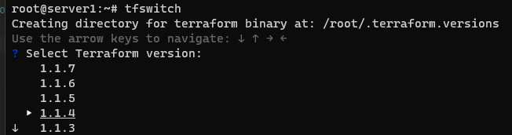

# Домашнее задание к занятию "7.1. Инфраструктура как код"


## Обязательная задача 1

Легенда

Через час совещание на котором менеджер расскажет о новом проекте. Начать работу над которым надо будет уже сегодня. На данный момент известно, что это будет сервис, который ваша компания будет предоставлять внешним заказчикам. Первое время, скорее всего, будет один внешний клиент, со временем внешних клиентов станет больше.

Так же по разговорам в компании есть вероятность, что техническое задание еще не четкое, что приведет к большому количеству небольших релизов, тестирований интеграций, откатов, доработок, то есть скучно не будет.

Вам, как девопс инженеру, будет необходимо принять решение об инструментах для организации инфраструктуры. На данный момент в вашей компании уже используются следующие инструменты:

- остатки Сloud Formation,
- некоторые образы сделаны при помощи Packer,
- год назад начали активно использовать Terraform,
- разработчики привыкли использовать Docker,
- уже есть большая база Kubernetes конфигураций,
- для автоматизации процессов используется Teamcity,
- также есть совсем немного Ansible скриптов,
- и ряд bash скриптов для упрощения рутинных задач.

Для этого в рамках совещания надо будет выяснить подробности о проекте, что бы в итоге определиться с инструментами:

1. Какой тип инфраструктуры будем использовать для этого проекта: изменяемый или не изменяемый?
```
Думаю не изменяемый. Т.к. по легенде клиентов будет становится все больше и больше, будет проще и быстрее управлять с неизменяемой архитектурой. Лучше если будут везде единтичные сервера, чем обновлять каждый сервер отдельно. 

```
2. Будет ли центральный сервер для управления инфраструктурой?
```
Т.к. скорее всего мы будем использовать Ansible и/или Terraform в будущем, то центральный сервер нам ставить не обязательно. Но в будущем, если проект разрастется и клиентов станет больше, можно будет его внедрить. 
```
3. Будут ли агенты на серверах?
```
Нет, Ansible и/или Terraform не требуют установки агентов. 
Опять же нужно отталкиваться от проекта, возможно потребуется доп. софт (например Git)
```
4. Будут ли использованы средства для управления конфигурацией или инициализации ресурсов?
```
На данный момент я бы выбрал управление конфигурацией (Ansible), т.к. я больше понимаю как это работает, чем Terraform (инициализация ресурсов). Возможно в будущем поменяю свое решение. 
```

В связи с тем, что проект стартует уже сегодня, в рамках совещания надо будет определиться со всеми этими вопросами.

В результате задачи необходимо

Ответить на четыре вопроса представленных в разделе "Легенда".
- Какие инструменты из уже используемых вы хотели бы использовать для нового проекта?
- Хотите ли рассмотреть возможность внедрения новых инструментов для этого проекта?
- Если для ответа на эти вопросы недостаточно информации, то напишите какие моменты уточните на совещании.


## Обязательная задача 2

Официальный сайт: https://www.terraform.io/

Установите терраформ при помощи менеджера пакетов используемого в вашей операционной системе. В виде результата этой задачи приложите вывод команды terraform --version.
```
vagrant@server1:~$ terraform --version
Terraform v1.1.7
on linux_amd64
```

## Обязательная задача 3

В какой-то момент вы обновили терраформ до новой версии, например с 0.12 до 0.13. А код одного из проектов настолько устарел, что не может работать с версией 0.13. В связи с этим необходимо сделать так, чтобы вы могли одновременно использовать последнюю версию терраформа установленную при помощи штатного менеджера пакетов и устаревшую версию 0.12.

В виде результата этой задачи приложите вывод --version двух версий терраформа доступных на вашем компьютере или виртуальной машине.

```
Откатил версию с помощью Terraform Switcher
```
